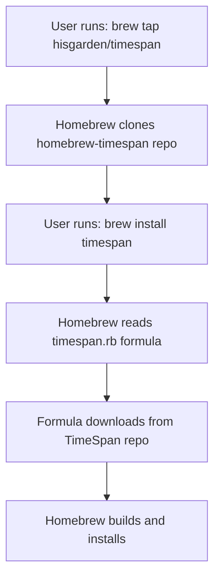

# Understanding Homebrew Repository Structure

## Why Two Repositories?

When distributing software via Homebrew, you typically need **two separate repositories**:

1. **Main Project Repository** (`hisgarden/TimeSpan`) - Your actual application code
2. **Homebrew Tap Repository** (`hisgarden/homebrew-timespan`) - Contains only the Homebrew formulas

## 📁 Repository Separation Explained

### `hisgarden/TimeSpan` (Main Repository)
**Purpose**: Contains your actual application source code
**Contents**:
- Source code (`src/`)
- Cargo.toml, Cargo.lock
- Documentation (README.md, etc.)
- Tests
- Release binaries (in releases)
- Formula files (for development/reference)

**Users interact with this for**:
- Downloading source code
- Reporting issues
- Contributing to the project
- Getting releases

### `hisgarden/homebrew-timespan` (Tap Repository) 
**Purpose**: Contains only Homebrew formulas for distribution
**Contents**:
- `timespan.rb` (main formula)
- `timespan@dev.rb` (development formula)
- `README.md` (installation instructions)
- No source code!

**Users interact with this for**:
- Installing via Homebrew: `brew tap hisgarden/timespan`
- Homebrew automatically pulls formulas from here

## 🔄 How They Work Together



### Installation Flow:
1. **User adds tap**: `brew tap hisgarden/timespan`
   - Homebrew clones `hisgarden/homebrew-timespan` 
   - Makes formulas available locally

2. **User installs package**: `brew install timespan`
   - Homebrew reads `timespan.rb` from the tap
   - Downloads source from `hisgarden/TimeSpan` (the URL in the formula)
   - Builds and installs the software

## 🎯 Why This Separation?

### 1. **Clean Organization**
- Main repo stays focused on your application
- Homebrew tap only contains distribution metadata
- No mixing of source code with package management files

### 2. **Homebrew Conventions**
- Homebrew expects taps to be named `homebrew-*`
- Taps should contain only formulas, not source code
- Follows established patterns (homebrew-core, homebrew-cask, etc.)

### 3. **Independent Updates**
- You can update formulas without changing source code
- Source releases are independent of packaging updates
- Multiple versions can be supported simultaneously

### 4. **User Experience**
- Users get clean installation: `brew tap user/repo`
- Homebrew automatically handles dependencies and updates
- Familiar pattern for Homebrew users

## 📋 What Goes in Each Repository

### `hisgarden/TimeSpan` Contains:
```
TimeSpan/
├── src/                    # Source code
├── Cargo.toml             # Rust project file
├── README.md              # Project documentation
├── Formula/               # Development formulas (optional)
│   ├── timespan.rb
│   └── timespan-local.rb
└── target/release/        # Built binaries
```

### `hisgarden/homebrew-timespan` Contains:
```
homebrew-timespan/
├── README.md              # Installation instructions
├── timespan.rb           # Main formula
└── timespan@dev.rb       # Development formula
```

## 🛠️ Repository Setup Process

### 1. Main Repository (Already exists)
```bash
# Your TimeSpan repository - already set up ✅
git remote -v
# origin  git@github.com:hisgarden/TimeSpan.git
```

### 2. Tap Repository (Needs creation)
```bash
# Create on GitHub: hisgarden/homebrew-timespan
# Then locally:
cd /Users/hisgarden/workspace/homebrew-timespan
git remote add origin https://github.com/hisgarden/homebrew-timespan.git
git push -u origin main
```

## 🔧 Alternative Approaches

### Option 1: Separate Repositories (Recommended)
✅ **Pros**: Clean separation, follows conventions, scalable
❌ **Cons**: Requires managing two repositories

### Option 2: Single Repository with Formula Directory
```bash
# Keep formulas in main repo
hisgarden/TimeSpan/Formula/timespan.rb
# Users install with full path:
brew install hisgarden/TimeSpan/Formula/timespan.rb
```
✅ **Pros**: One repository to manage
❌ **Cons**: Non-standard, harder for users, mixing concerns

### Option 3: Submit to homebrew-core
```bash
# Submit formula to official Homebrew
# Users install with just:
brew install timespan
```
✅ **Pros**: Maximum visibility, official support
❌ **Cons**: Strict requirements, review process, less control

## 🎯 Recommended Setup

**Use the two-repository approach** (Option 1):

1. **Main repo** (`hisgarden/TimeSpan`): Your application ✅ Already done
2. **Tap repo** (`hisgarden/homebrew-timespan`): Distribution formulas ⏳ Ready to create

This follows Homebrew best practices and provides the best user experience.

## 📋 Next Steps

1. **Create GitHub repository**: `hisgarden/homebrew-timespan`
2. **Push tap contents**:
   ```bash
   cd /Users/hisgarden/workspace/homebrew-timespan
   git remote add origin https://github.com/hisgarden/homebrew-timespan.git
   git push -u origin main
   ```
3. **Test installation**:
   ```bash
   brew tap hisgarden/timespan
   brew install timespan
   ```

The two-repository structure is the standard, recommended approach for Homebrew distribution! 🍺